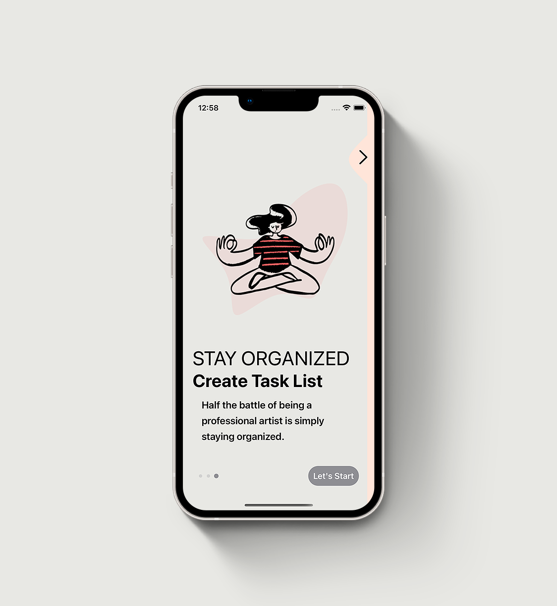
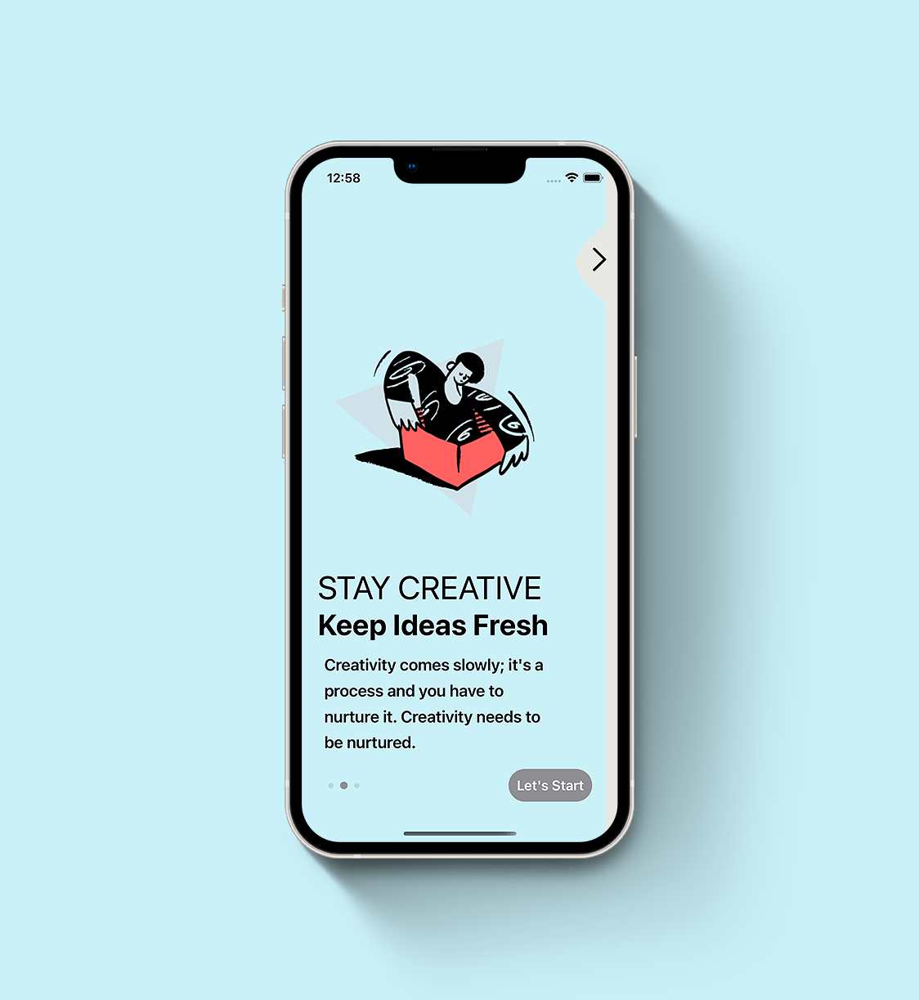
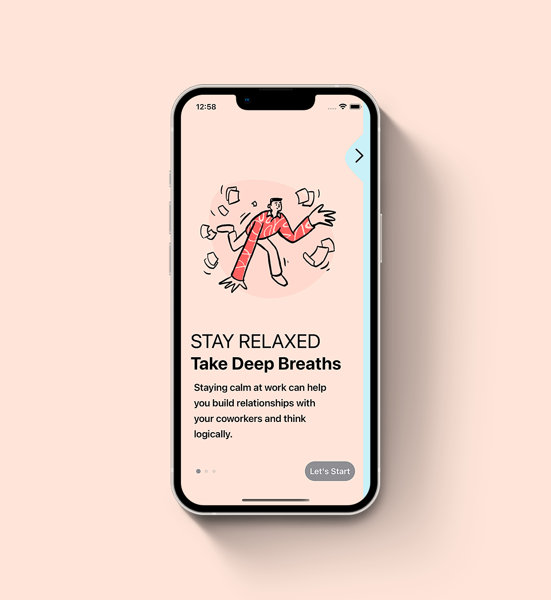

# Animated Onboarding Screens 🤓

Animated iOS App Onboarding Screens With Liquid Swipe Animation Using SwiftUI 3.0 for learning purposes.

[](https://opensource.org/licenses/Apache-2.0)
[](https://github.com/shameemreza/stylishintro/blob/main/LICENSE)


## Video Preview

[](https://youtu.be/KSgnT3e_MwQ "Animated Onboarding Screens")

## Screenshots






## Features

* SwiftUI Liquid Swipe Animations
* SwiftUI OnBoarding Page UI
* SwiftUI Welcome Page UI
* SwiftUI Infinite Carousel Slider
* SwiftUI Custom Shapes
* SwiftUI Animatable Shapes
* SwiftUI Complex UI
* SwiftUI Custom Animations
* SwiftUI Xcode 13
* SwiftUI for iOS 15
* Xcode 13 SwiftUI


Resources:

* [Liquid Aniamtion by Balaji Venkatesh](https://www.youtube.com/watch?v=VIqXC0tqbLo)
* [Peel Away Navigation Design Idea from Freepik.com](https://www.freepik.com/premium-vector/automation-types-white-blue-onboarding-template_23840858.htm)
* [Illustrations by Pablo Stanly](https://dribbble.com/pablostanley)


## License

```
Copyright 2022 Shameem Reza

Licensed under the Apache License, Version 2.0 (the "License");
you may not use this file except in compliance with the License.
You may obtain a copy of the License at

   http://www.apache.org/licenses/LICENSE-2.0

Unless required by applicable law or agreed to in writing, software
distributed under the License is distributed on an "AS IS" BASIS,
WITHOUT WARRANTIES OR CONDITIONS OF ANY KIND, either express or implied.
See the License for the specific language governing permissions and
limitations under the License.
```
